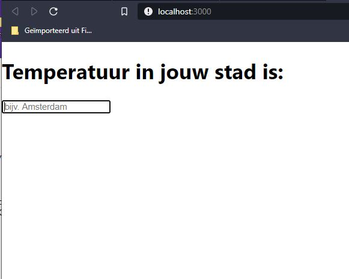
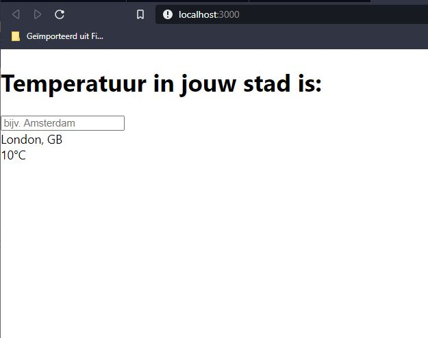

# OpenWeatherAPI

This project was made with [OpenweatherAPI](https://openweathermap.org/) and [Javascript JS](https://reactjs.org/)

## About

This project is build in React and using the OpenWeatherAPI.
If you want to use this application make sure you get your own API key. You can get the key on the website [OpenweatherAPI](https://openweathermap.org/). 

Searches [press Enter] the Openweather Database and looks for the inserted country or city.
Invalid input returns an empth textbox.

See the screenshots below 

